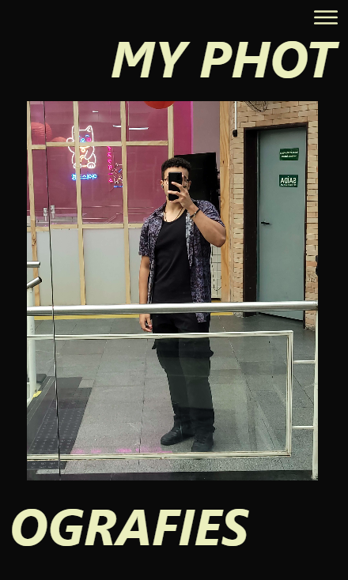
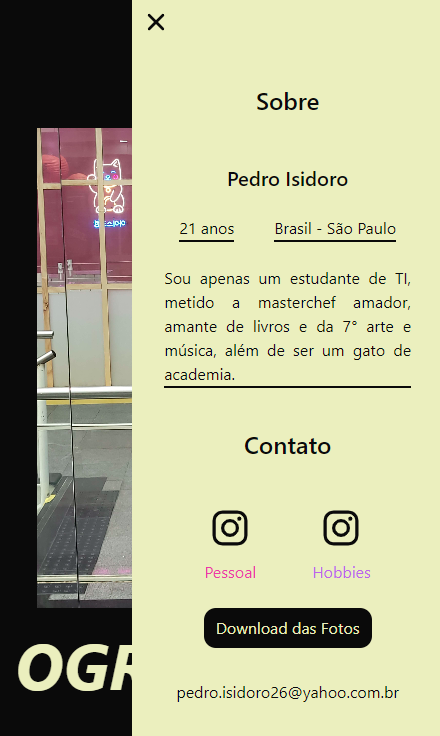

# Projeto Detalhando meus Hobbies
    - Um projeto simples, para apresentação de minhas fotos pessoais e autorais. Mostrando looks de roupa e poses.
    - Além de práticar o uso do Typescript e Vitest + Testing Library

## Tecnologias Utilizadas
- HTML
- CSS
- TypeScript

## Bibliotecas Utilizadas
- React
- Vite
- Tailwind
- Vitest

## Desafios

        Realizar os Testes com React + Jest + Testing Library

## Soluções

    Primeiro tentei, e tentei e tentei realizar os testes com Jest + ting Library, mas infelizmente não consegui.
      
    Então continuei estudando sobre e achei o Vitest + Testing Library, onde estudei sobre, e depois de ler as documentações e ir e vir várias vezes atrás de respostas nelas consegui desenvolver os teste.
      
    Podem até ser simples, mas consegui com que dessem certo e passassem.

## Visual do Projeto

<h4 id="visual">Post do Projeto"</h4>